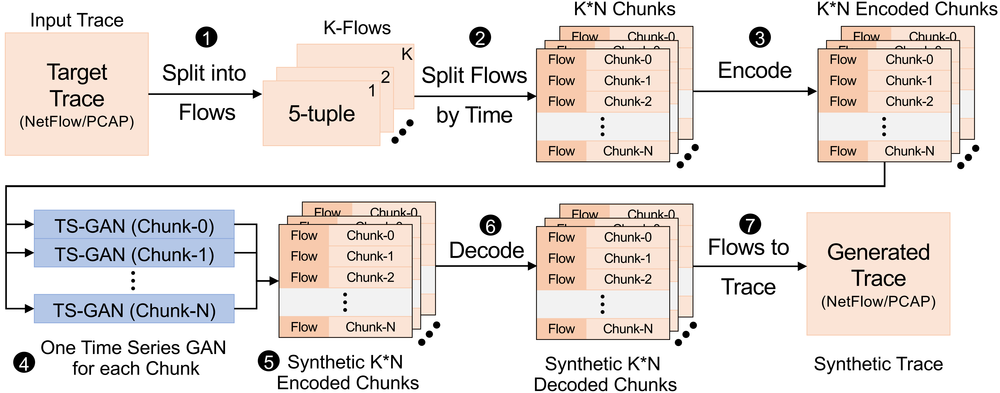
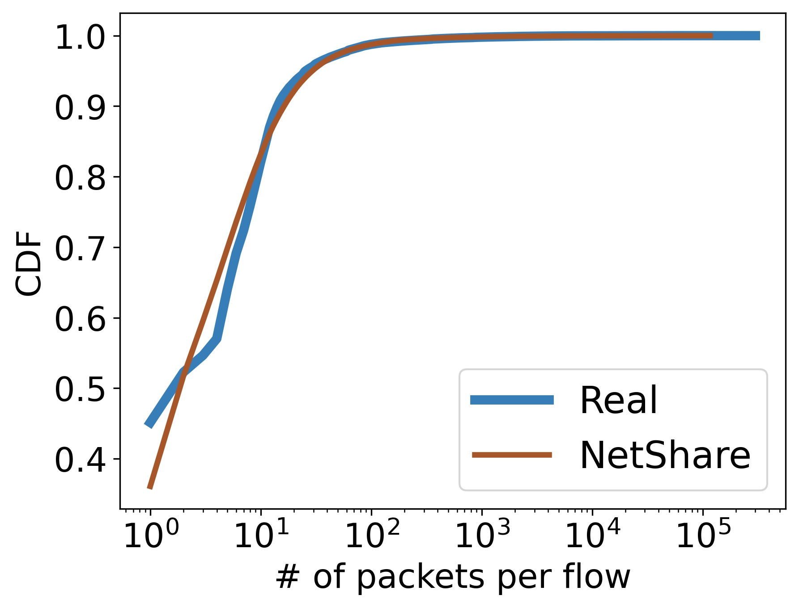
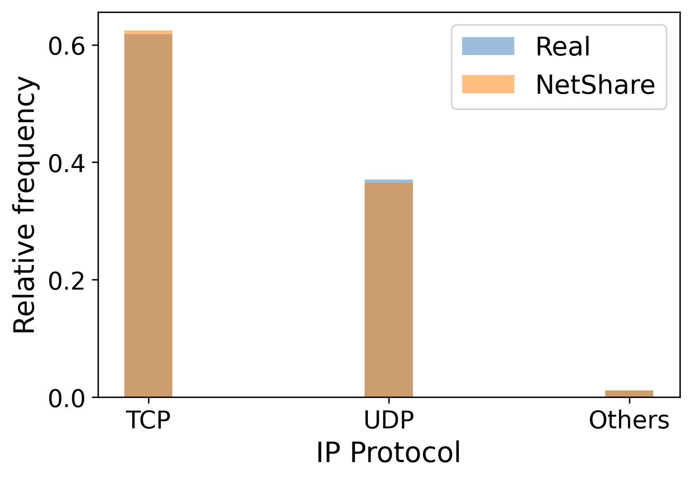
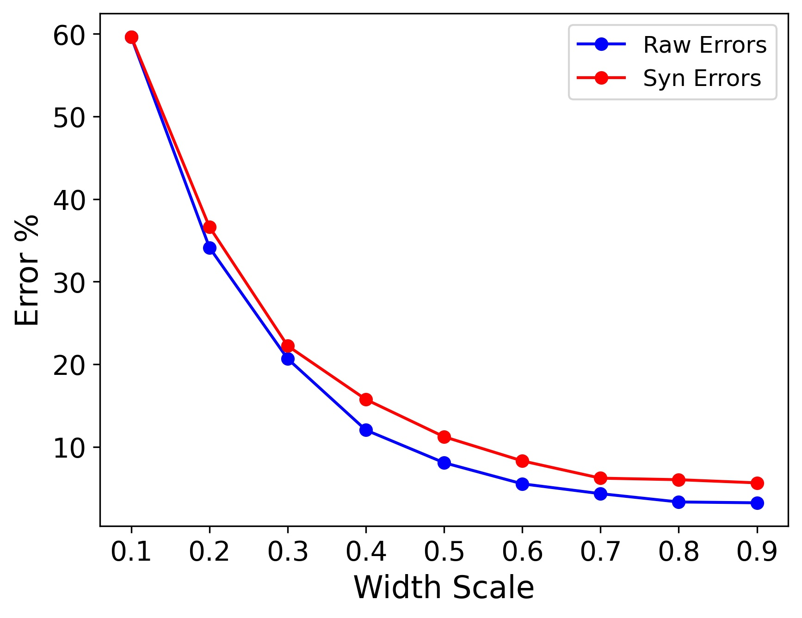

### Motivation
Packet and flow level header traces are critical to many network management tasks, for instance they are used to develop new types of anomaly detection algorithms but access to such traces remains challenging due to business and privacy concerns. An alternative is to generate synthetic traces. 

In this project, we aim to reproduce NetShare, which can tackle many of the challenges by carefully understanding the limitations of GAN-based methods. They followed the following key ideas in building NetShare to tackle:

1. Learning synthetic models for a merged flow-level trace across epochs instead of treating header traces from each epoch as an independent tabular dataset. This reformulation captures the intra-and inter-epoch correlations of traces.
2. Data parallelism learning was introduced in this approach to improve the scalability.
3. To deal with privacy concerns for sharing the traces, differentially-private model training was used.

The major contribution of the project is to effectively split the input into different chunks with respect to time and then encode and train them with a time-series GAN. This allows us to process the data faster and parallely train various models to generate results faster. 

### Implementation
The implementation didn't work out of the box so we modified some of the code base to make it easier to reproduce the work. You can find more instructions to reproduce the work below. 

Most of the implementation was redone to ensure that all the experiments can be run on a single machine as opposed to the multi-machine setup recommended by the authors. 

### Results

We observed the following graphs after running the experiments inside the `eval` folder. 

#### UGR16 Results

  
   
  
  

The above graphs denote the 
[CDF](https://en.wikipedia.org/wiki/Cumulative_distribution_function) with respect to
- Bytes
- Packets
- 5 Tuple
- Type of protocol

#### CAIDA Results

  
   
  

The above graphs denote the 
[Count Min Sketch](https://en.wikipedia.org/wiki/Count%E2%80%93min_sketch) with respect to
- Destination IP
- Source IP
- Five-tuple aggregation

#### Downstream Testing (Botnet) Results

  
   

The above graphs denote the 
[Spearman Correlation](https://en.wikipedia.org/wiki/Spearman%27s_rank_correlation_coefficient) and CDF with respect to the flow size.

#### Conculsion
Based on the graphs,we draw the following observations from the results:

1. NetShare achieves high fidelity on feature distribution metrics across traces.

2. NetShare-generated traces perform with high-accuracy on Anomaly Detection Tasks

3. NetShare preserves the relative rank-order of Anomaly Detection algorithm performance

4. NetShare-generated traces perform similar to original traces on Telemetry
