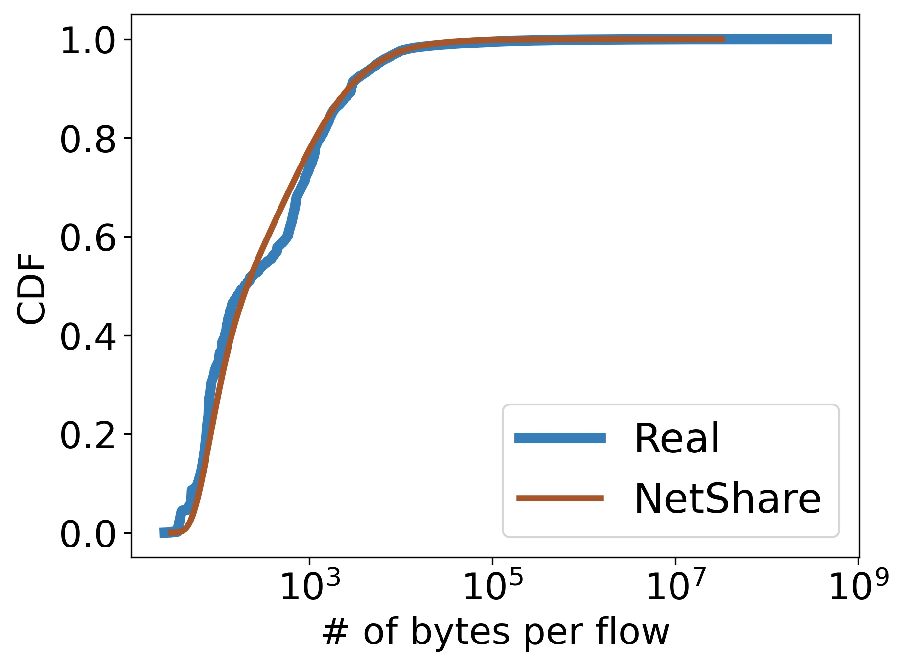
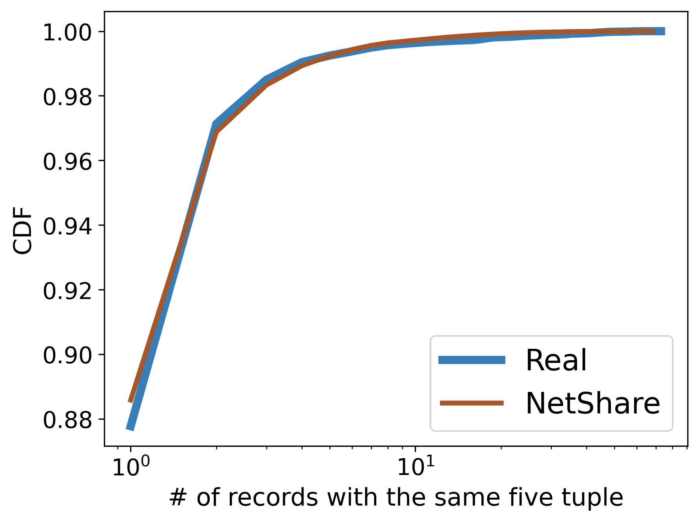
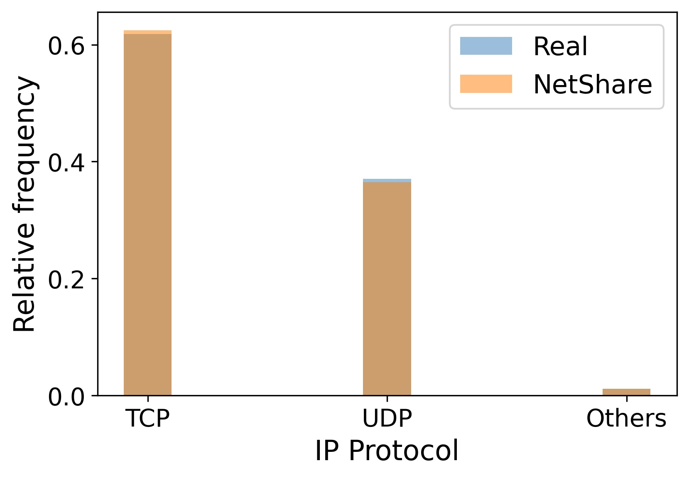
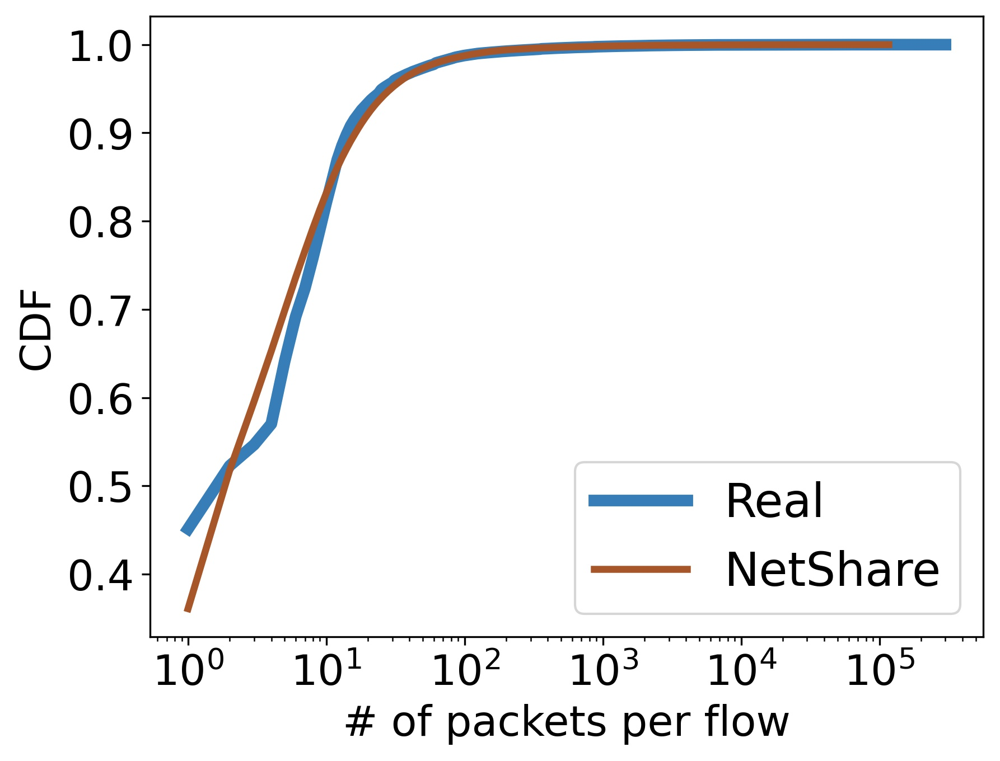
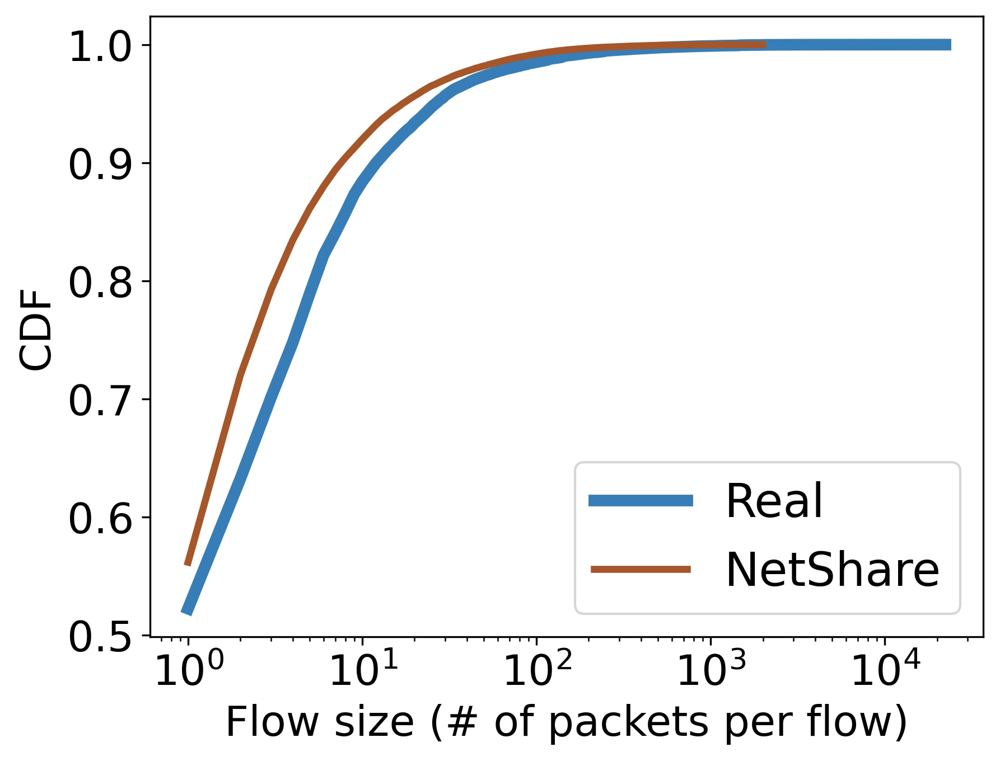
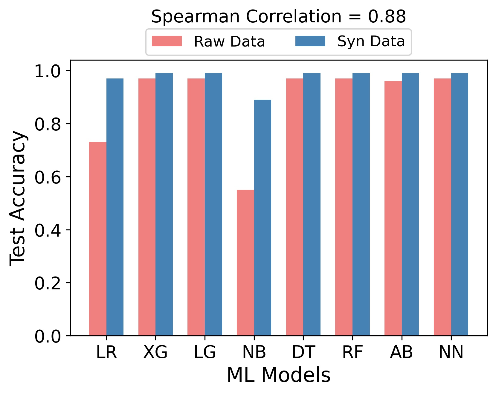
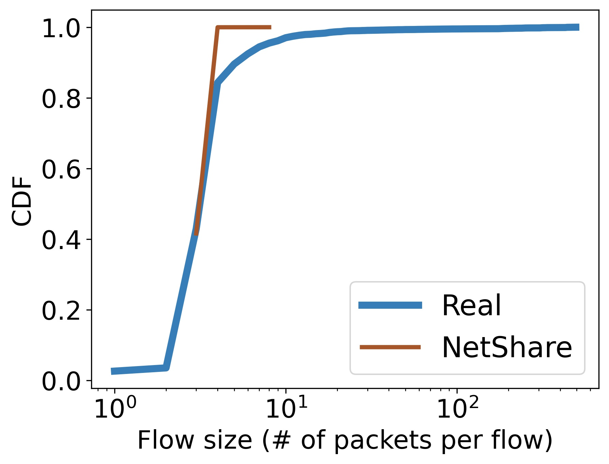

# Reproduction of Practical GAN-based Synthetic IP Header Trace Generation using NetShare 

## Blogpost

Packet and flow level header traces are critical to many network management tasks, for instance they are used to develop new types of anomaly detection algorithms but access to such traces remains challenging due to business and privacy concerns. An alternative is to generate synthetic traces. 

In this project, we aim to reproduce NetShare, which can tackle many of the challenges by carefully understanding the limitations of GAN-based methods. They followed the following key ideas in building NetShare to tackle:

1. Learning synthetic models for a merged flow-level trace across epochs instead of treating header traces from each epoch as an independent tabular dataset. This reformulation captures the intra-and inter-epoch correlations of traces.
2. Data parallelism learning was introduced in this approach to improve the scalability.
3. To deal with privacy concerns for sharing the traces, differentially-private model training was used.


The implementation didn't work out of the box so we modified some of the code base to make it easier to reproduce the work. You can find more instructions to reproduce the work below. 

We noticed the following results from the work

1. NetShare achieves high fidelity on feature distribution metrics across traces.

2. NetShare-generated traces perform with high-accuracy on Anomaly Detection Tasks

3. NetShare preserves the relative rank-order of Anomaly Detection algorithm performance

4. NetShare-generated traces perform similar to original traces on Telemetry

We analyze the downstream task of heavy hitter count estimation with Count-Min (CM) Sketch[*]. Count-Min (CM) Sketch is an algorithm that allows us to approximately count the frequency of the events on the streaming data with relatively low memory consumption.

#### UGR16 Results
<p align="left">
  
</p>
<p align="center">
  
</p>
<p align="right">
  
</p>




#### Caida Results

#### Downstream Testing (Botnet) Results



Interesting results? 

<details><summary><b>(Click here for setup)</b></summary>
<br>

## CS536 Project Setup

> Please download the dataset file [here](https://drive.google.com/file/d/1GmA1Jzqf4RuN7IJUCjInv9IoMcXmJhYO/view?usp=sharing) and unzip to `data/` directory in the project directory before proceeding to the next step.

### Run the following Makefile targets in this order
```sh
conda activate NetShare

cd /path/to/NetShare/home-directory/

# 1. To preprocess the dataset without differential privacy
make preprocess-no-dp

# 2. Clean the previous training outputs before retraining
make clean-results

# 3. To train the GAN
make train-no-dp

# 4. To generate using the trained GAN
make generate-no-dp

```

# Setup
## Single-machine setup
Single-machine is only recommended for very small datasets and quick validation/prototype as GANs are very computationally expensive. We recommend using virtual environment to avoid conflicts (e.g., Anaconda).

```Bash
# Assume Anaconda is installed
# create virtual environment
conda create --name NetShare python=3.6

# installing dependencies
cd util/
pip3 install -r requirements.txt
```
# Dataset preparation
## Description
Datasets used for the experiments

1. [UGR16](https://nesg.ugr.es/nesg-ugr16/) dataset consists of traffic (including attacks) from NetFlow v9 collectors in a Spanish ISP network. We used data from the third week of March 2016. 

2. [CAIDA](https://www.caida.org/catalog/datasets/passive_dataset/) contains anonymized traces from high-speed monitors on a commercial backbone link. Our subset is from the New York collector in March 2018. (**Require an CAIDA account to download the data**)

</details>
</br>

<details><summary><b>Project info</b></summary>
<br>

**Class Project:** Akanksha Cheeti, Annus Zulfiqar, Ashwin Nambiar,Syed Hasan Amin, Murayyiam Parvez, Syed Muhammed Abubaker

[[Class Project Slides](https://github.com/annuszulfiqar2021/NetShare/blob/project_ready/CS536_ProjectPresentation.pptx.pdf)][[Insert class project report](link)]


[[paper (SIGCOMM 2022)](https://dl.acm.org/doi/abs/10.1145/3544216.3544251)][[talk (SIGCOMM 2022)](https://www.youtube.com/watch?v=mWnFIncjtWg)][[web service demo](https://drive.google.com/file/d/1vPuneEb14A2w7fKyCJ41NAHzsvpLQP5H/view)]

**Authors:** [[Yucheng Yin](https://sniperyyc.com/)] [[Zinan Lin](http://www.andrew.cmu.edu/user/zinanl/)] [[Minhao Jin](https://www.linkedin.com/in/minhao-jin-1328b8164/)] [[Giulia Fanti](https://www.andrew.cmu.edu/user/gfanti/)] [[Vyas Sekar](https://users.ece.cmu.edu/~vsekar/)]

**Abstract:** We aim to reproduce the NetShare paper from SIGCOMM 22. This paper proposes Generative Adversarial Neural Networks (GANs) for generating synthetic packet traces for applications such as telemetry and anomaly detection since real-world network traces are a scarce resource.  Using GANs for synthetic data generation is not a new concept in Machine Learning. However, networking applications are very sensitive to difficult-to-model properties of real network traces (such as inter-arrival time, flow sizes, RTTs) that are hard to capture in synthetically generated traces. The novelty in their approach involves identifying and resolving some key fidelity and scalability challenges (along with their tradeoffs) for generating synthetic traces. Key evaluations indicate 46% improvement in the distributional metrics against existing trace generation approaches. We aim to analyze how authentically their framework captures real-world trace properties and whether the generated traces bring any new data features or simply mimic the properties in the chosen datasets without adding any valuable information.
</details>
</br>

# Refererence
Part of the source code is adapated from the following open-source projects:

- [DoppelGANger](https://github.com/fjxmlzn/DoppelGANger)
- [GPUTaskScheduler](https://github.com/fjxmlzn/GPUTaskScheduler)
- [BSN](https://github.com/fjxmlzn/BSN)
