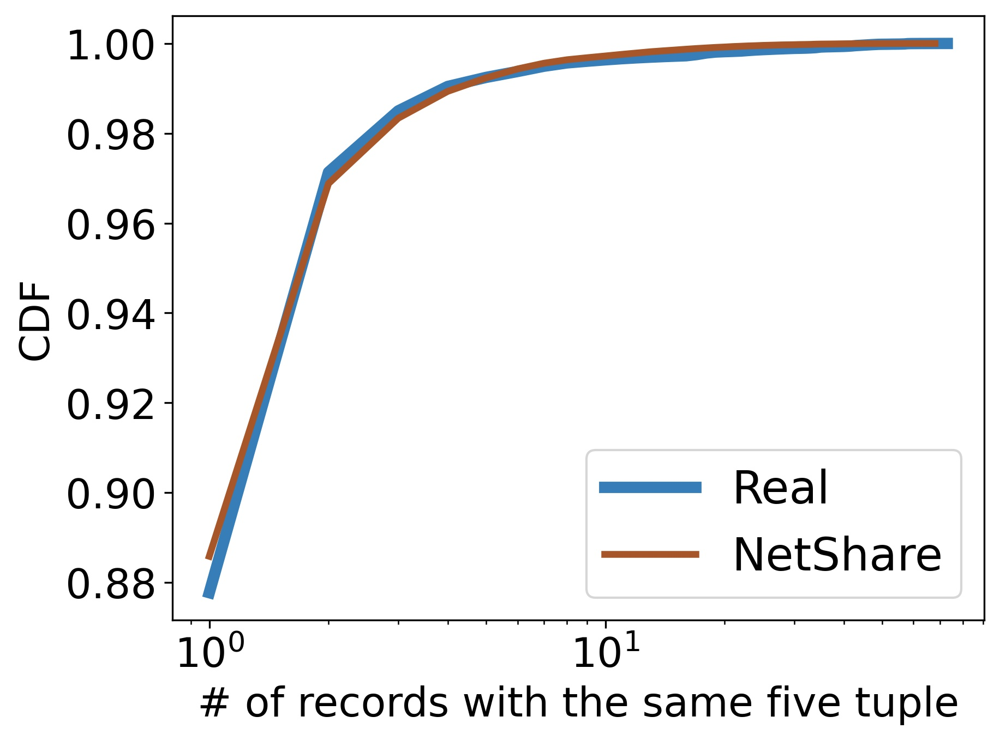

# Reproducing Practical GAN-based Synthetic IP Header Trace Generation using NetShare 

### Motivation
Packet and flow level header traces are critical to many network management tasks. For instance they are used to develop new types of anomaly detection algorithms and even test new hardware/software systems with trace replay but access to such traces remains challenging due to business and privacy concerns. An alternative is to generate synthetic traces. 

In this project, we aim to reproduce NetShare, a time-series GAN-based synthetic trace generation approach presented in ACM SIGCOMM'22. NetShare can tackle many of the challenges by carefully handling the limitations of prior GAN-based methods. The key ideas from NetShare include:

1. Learning GAN models to generate synthetic chunks of flows (common 5-tuple) instead of treating header traces as a tabular dataset of arbitrary flows. This reformulation captures the intra-and inter-epoch correlations of traces.
2. Data parallelism: owing to the above, a GAN for each chunk can be trained independent of the other GANs, hence scalability. Instead of sequentially training a single huge model for long period of time, many smaller models can be trained in parallel on a cluster.
3. To deal with privacy concerns for sharing the traces, Differentially-Private Stochastic Gradient Descent (DP-SGD) can be used as the training algorithm of NetShare to generate synthetic traces that preseve privacy of target traces.


This figure shows the NetShare trace generation pipeline. NetShare works with both, packet header PCAPs and flow samples like NetFlow. The input packet/flow trace is split into a set of flows based on their 5-tuples (K in number), and each of these flows is further split into N chunks based on time duration of the flow. NetShare divides each flow into 10 chunks (N = 10). The packet/flow fields of these chunks are encoded using continuous and categorical encoding functions, and these ecoded chunks are fed into NetShare's DoppleGANger time-series GANs, a specific variant of time-series GANs that work well with time-series data (such as header traces!). There are N number of GANS in total, each of which learns to generate a specific chunk of any flow. Once trained, these models are used to generate synthetic (encoded) chunks, which are decoded and assembled into a full trace by sorting all the packets/flows by their timestamps. The main insight of NetShare is to split the input into chunks with respect to time and train a separate model for each chunk using a time-series GAN. This allows us to process the data faster and parallely train various models to generate results faster. 

### Implementation
The NetShare artifact was made available with the paper, and we used their DoppleGANger implementation. Although the code was available, several reproducibility issues were met. First, the approach scales with compute resources, and the original models in the paper were trained on a 200 CPU + 200 GB Memory cluster. This kind of setting is hard to replicate for a course project, so we resorted to the best Google Cloud VM that we could get for $300 worth of free credits. We setup NetShare with a 32 CPU VM and patched the code to work on a single instance. Still, we found out that limited compute meant limited training time for the models, and this caused issues with our earlier attempts at generating CAIDA traces. 

### Challenges
One of the major challenges we faced, was to get the same resource intensive setup the authors had used for their project, it was difficult for us to obtain resources on such a scale. 
And because of the lack of such resources, we were unable to generate traces of the similar quality as described in the paper. 

### Results
The dataset used for these graphs are from the [CAIDA](https://www.caida.org/catalog/datasets/passive_dataset/) and [UGR16](https://nesg.ugr.es/nesg-ugr16/) and a malicious botnet data from [Netflow](https://github.com/dmbb/FlowLens). 

We observed the following graphs after running the experiments inside the `eval` folder. 


#### UGR16 Results
<p float="center">
  
   
  
  
  
</p>

The above graphs denote the 
[CDF](https://en.wikipedia.org/wiki/Cumulative_distribution_function) with respect to
- Bytes
- Packets
- 5 Tuple
- Type of protocol
- Destination port

These graphs here indicate that how the real traces and the synthetic traces have high co-relation across several properties. Hence, it generates traces with high fidelity. From the above results, we can see that generated packets maintain similar fidelity as the original traces.

In the paper, we also show the Jensen-Shannon Divergence for different packet fields. 

#### CAIDA Results
<p float="center">
  
   
  
</p>

The above graphs denote the 
[Count Min Sketch](https://en.wikipedia.org/wiki/Count%E2%80%93min_sketch) this enables to count the frequency of the events on the streaming data. With respect to
- Destination IP
- Source IP
- Five-tuple aggregation

They also indicate that downstream applications perform similar to the original traces on the telemetry applications. 


#### Downstream Testing (Botnet) Results
<p float="center">
  
   
</p>

The above graphs denote the 
[Spearman Correlation](https://en.wikipedia.org/wiki/Spearman%27s_rank_correlation_coefficient) and CDF with respect to the flow size.

Based on the above results, we can also determine that the generated traces perform similar to the actual traces for anomaly detection. The Spearman correlation of 0.88 indicates the relation between the original and synthetic traces. This allows to use to the synthetic traces for anomaly detection. 


#### Conculsion
Based on the graphs,we draw the following observations from the results:

1. NetShare achieves high fidelity on feature distribution metrics across traces.

2. NetShare-generated traces perform with high-accuracy on Anomaly Detection Tasks

3. NetShare preserves the relative rank-order of Anomaly Detection algorithm performance

4. NetShare-generated traces perform similar to original traces on Telemetry

#### Acknowledgements
We would like to thank the author (Yucheng Yin) for provid- ing synthetic traces for CAIDA and UGR generated from their compute cluster of 200 CPUs.

Did you find the results interesting ? You can replicate the experiment by following setup guide below! 


### Project details 

**Class Project:** Akanksha Cheeti, Annus Zulfiqar, Ashwin Nambiar,Syed Hasan Amin, Murayyiam Parvez, Syed Muhammed Abubaker

[[Class Project Slides](https://github.com/annuszulfiqar2021/NetShare/blob/project_ready/CS536_ProjectPresentation.pptx.pdf)][[Class Project Report](https://github.com/annuszulfiqar2021/NetShare/blob/project_ready/purdue-cs536-fall22-paper1.pdf)]

[[paper (SIGCOMM 2022)](https://dl.acm.org/doi/abs/10.1145/3544216.3544251)][[talk (SIGCOMM 2022)](https://www.youtube.com/watch?v=mWnFIncjtWg)]

**Authors:** [[Yucheng Yin](https://sniperyyc.com/)] [[Zinan Lin](http://www.andrew.cmu.edu/user/zinanl/)] [[Minhao Jin](https://www.linkedin.com/in/minhao-jin-1328b8164/)] [[Giulia Fanti](https://www.andrew.cmu.edu/user/gfanti/)] [[Vyas Sekar](https://users.ece.cmu.edu/~vsekar/)]

### CS536 Project Setup

> Please download the dataset file [here](https://drive.google.com/file/d/1GmA1Jzqf4RuN7IJUCjInv9IoMcXmJhYO/view?usp=sharing) and unzip to `data/` directory in the project directory before proceeding to the next step.

#### Run the following Makefile targets in this order
```sh
conda activate NetShare

cd /path/to/NetShare/home-directory/

# 1. To preprocess the dataset without differential privacy
make preprocess-no-dp

# 2. Clean the previous training outputs before retraining
make clean-results

# 3. To train the GAN
make train-no-dp

# 4. To generate using the trained GAN
make generate-no-dp

```

### Setup
#### Single-machine setup
Single-machine is only recommended for very small datasets and quick validation/prototype as GANs are very computationally expensive. We recommend using virtual environment to avoid conflicts (e.g., Anaconda).

```Bash
# Assume Anaconda is installed
# create virtual environment
conda create --name NetShare python=3.6

# installing dependencies
cd util/
pip3 install -r requirements.txt
```
### Dataset preparation
#### Description
Datasets used for the experiments

1. [UGR16](https://nesg.ugr.es/nesg-ugr16/) dataset consists of traffic (including attacks) from NetFlow v9 collectors in a Spanish ISP network. We used data from the third week of March 2016. 

2. [CAIDA](https://www.caida.org/catalog/datasets/passive_dataset/) contains anonymized traces from high-speed monitors on a commercial backbone link. Our subset is from the New York collector in March 2018. (**Require an CAIDA account to download the data**)

### Refererence
Part of the source code is adapated from the following open-source projects:

- [DoppelGANger](https://github.com/fjxmlzn/DoppelGANger)
- [GPUTaskScheduler](https://github.com/fjxmlzn/GPUTaskScheduler)
- [BSN](https://github.com/fjxmlzn/BSN)
